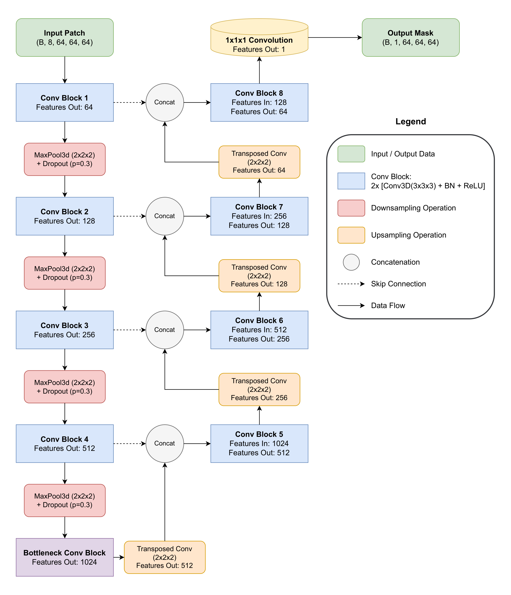
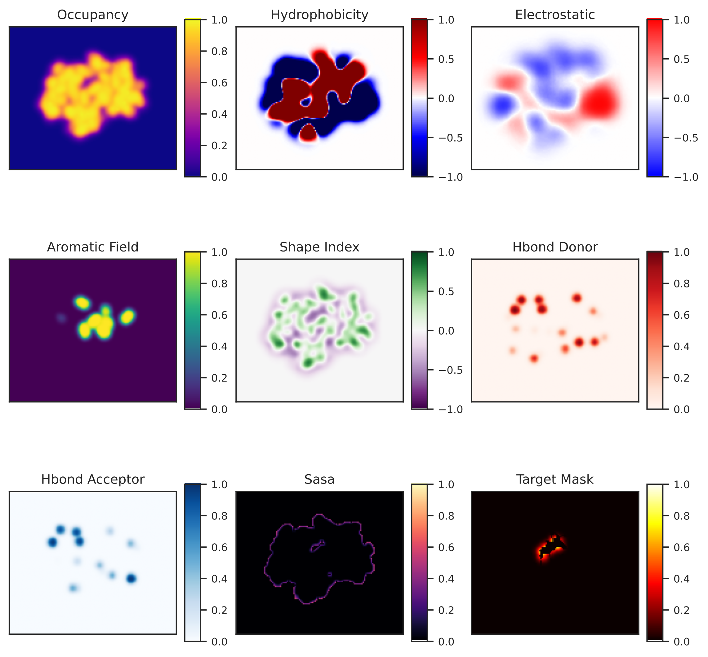
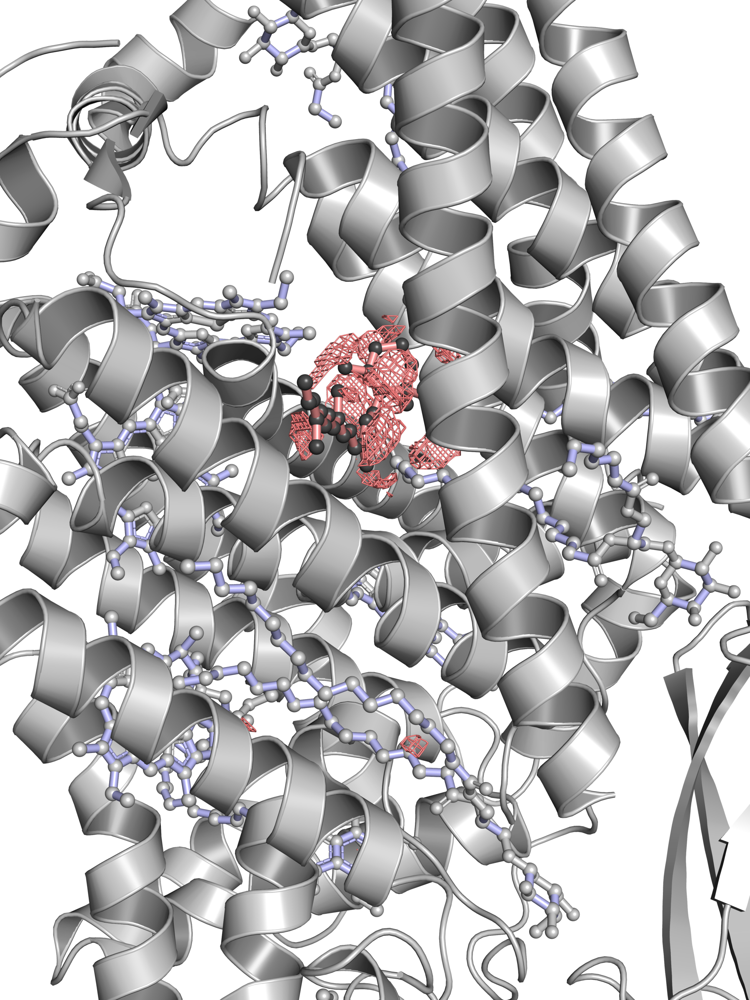
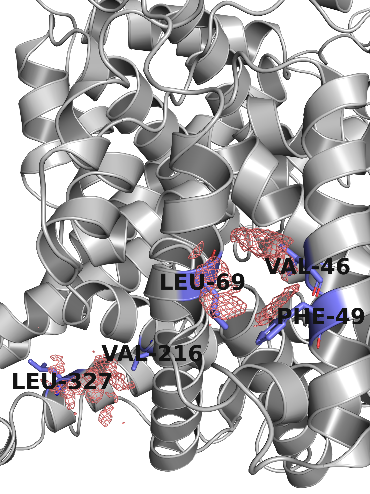

# ProteinSight: A Volumetric Deep Learning Model for Carotenoid-Binding Site Prediction

[](https://opensource.org/licenses/MIT) [](https://creativecommons.org/licenses/by-nc/4.0/) [](https://doi.org/10.1101/2025.10.30.685633) [](https://www.python.org/downloads/release/python-3120/) [](https://github.com/psf/black)

This repository contains the official implementation for the paper "ProteinSight: A Volumetric Deep Learning Model for Carotenoid-Binding Site Prediction". ProteinSight is a deep learning pipeline that identifies potential binding sites for carotenoids and related isoprenoids directly from the tertiary structure of a protein. The approach serves as a proof-of-concept for a new generation of structure-based protein function predictors.

The preprint has already been published! Follow https://doi.org/10.1101/2025.10.30.685633

Carotenoproteins play essential roles across all domains of life, yet identifying them from sequence or structure remains a significant challenge due to the lack of conserved motifs. To address this gap, we developed ProteinSight, which transforms a discrete atomic structure into a continuous, multi-channel volumetric representation of its physicochemical properties. By training a deep convolutional neural network on this representation, the model learns to perform semantic segmentation, effectively classifying regions in 3D space based on their likelihood of belonging to a carotenoid-binding pocket.

### Methodology Overview

The core of ProteinSight is a 3D U-Net, an architecture that has demonstrated robust performance in the analysis of volumetric data. The model is trained to transform an 8-channel input tensor describing a protein's local environment into a single-channel probability map corresponding to the ligand's position. The architecture is characterized by its symmetric, U-shaped structure, which comprises a contracting path (encoder) to extract contextual features at multiple scales and an expansive path (decoder) to enable precise localization of these features.

*Figure 1: The 3D U-Net architecture used for binding site segmentation. The model employs a symmetric encoder-decoder structure with skip connections to preserve high-resolution spatial information.*


The input to the model is a volumetric map with eight distinct feature channels. The selection of these features was guided by statistical analysis of known carotenoid-binding sites. These channels encode a combination of geometric and physicochemical properties, including molecular shape (Occupancy), local surface curvature (Shape Index), hydrophobicity, electrostatic potential, aromaticity, hydrogen bond donor and acceptor potentials, and a proxy for the solvent-accessible surface area (SASA). This multi-modal representation allows the model to learn the complex interplay of features that define a functional binding site.

*Figure 2: A 2D cross-section of the 8 input feature channels and the target mask for a representative carotenoid-binding protein (PDB ID: 5FCY).*


### Key Results

The trained ProteinSight model functions as a highly sensitive and specific detector, reliably distinguishing known carotenoid-binding proteins from negative controls. A qualitative analysis on cytochrome b6f (PDB ID: 1Q90), a beta-carotene-binding protein from the test set, demonstrates the model's ability to accurately delineate the elongated shape of the binding pocket and align precisely with the position of the bound ligand, while correctly ignoring other non-carotenoid ligands present in the structure.

*Figure 3: Prediction on a positive control case, cytochrome b6f (PDB ID: 1Q90). The predicted binding site is shown as a red mesh isosurface, which accurately encapsulates the experimentally determined position of the beta-carotene ligand.*


Furthermore, the model's utility for hypothesis generation was demonstrated on a challenging case: Human Serum Albumin (HSA, PDB ID: 1A06), a protein known for its promiscuous, non-specific binding of hydrophobic molecules. In the absence of a canonical binding pocket, ProteinSight identified two distinct, high-confidence hydrophobic patches on the protein surface, providing the first structural hypothesis for the experimentally observed association of carotenoids with albumin.

*Figure 4: Prediction of potential carotenoid interaction sites on Human Serum Albumin (PDB ID: 1A06). The model identifies two plausible surface patches, demonstrating its potential as a hypothesis-generation engine.*


### Installation

To set up the necessary environment for running the ProteinSight pipeline, certain prerequisites are required. This guide assumes you have an NVIDIA GPU with appropriate drivers and the CUDA Toolkit (version 12.1 or compatible) installed.

**1. Prerequisites**
The data preparation pipeline relies on two external command-line tools: `pdb2pqr` and `MMseqs2`. Please install them according to their official documentation and ensure they are available in your system's `PATH`.

**2. Clone the Repository**
Clone this repository to your local machine.
```bash
git clone https://github.com/MacSurmak/ProteinSight.git
cd ProteinSight
```

**3. Create and Activate the Conda Environment**
The provided `environment.yml` file contains all necessary Python dependencies, including specific versions of PyTorch compiled for CUDA 12.8, ensuring full reproducibility. Use the following commands to create and activate the environment.
```bash
conda env create -f environment.yml
conda activate proteinsight
```

### Usage Workflow

The full pipeline, from data preparation to model training and evaluation, is executed through a series of numerically ordered Python scripts located in the root directory. Please run them in the specified sequence.

**1. `0_find_carotenoids.py`**: Searches the PDB Chemical Component Dictionary to identify all carotenoid and related polyterpene ligands.

**2. `1_parse_positive.py` & `2_parse_negative.py`**: Download protein structures from the RCSB PDB, curate the positive and negative datasets, and cluster them using MMseqs2 to create non-redundant sets for training and evaluation.

**3. `3_prepare_pqr.py`**: Processes the downloaded CIF files, converts them to the PDB format, and then uses `pdb2pqr` to generate PQR files with assigned charges and protonation states at a physiological pH.

**4. `4_prepare_feature_cache.py`**: Converts the PQR files into multi-channel 3D feature maps using a high-performance GPU-accelerated algorithm. The resulting tensors are saved in HDF5 format.

**5. `6_create_patch_cache.py`**: Pre-calculates coordinates for sampling training patches (binding site centers, "cold" surface points, etc.) to accelerate the data loading process during training.

**6. `7_train_unet.py`**: Trains the 3D U-Net model using the generated feature caches. The script automatically saves the model with the best validation performance.

**7. `8_evaluate_on_test_set.py` & `9_evaluate_protein_metrics.py`**: Evaluate the performance of the trained model on the held-out test set using both voxel-level and object-level (volume-based) metrics.

**8. `inference.py`**: Performs inference on a new, single protein structure to predict potential carotenoid-binding sites.
```bash
python inference.py <PDB_ID>
```

### Pre-trained Model

We provide the final pre-trained model weights, which were trained for 128 epochs on the curated dataset described in our paper. The model can be used directly for inference without the need for retraining.

1.  **Download the model:** Navigate to the [**Releases**](https://github.com/your-username/ProteinSight/releases) page of this repository.
2.  **Get the weights file:** From the latest release (e.g., `v1.0.0`), download the asset named `unet_best_model.pth`.
3.  **Place the file:** Place the downloaded `unet_best_model.pth` file into a directory within the project structure. Define the path to the loaded model in the inference script (`inference.py`). 
4. **Set up the environment:** Install all dependencies, especially `pdb2pqr`. It is strongly recommended to set up CUDA, otherwise calculations may take a while, though `inference.py` can perform calculations on CPU.
5. **Run the calculations:** use the following command:
```bash
python inference.py --input_path /path/to/my_protein/1A06.pdb --output_dir /path/to/my_results/1A06_prediction
```
Script will create `/path/to/my_results/1A06_prediction` if it does not exist. Wait for the completion.

### Citation

If you use ProteinSight in your research, please cite our work:

```bibtex
@article{surkov2025proteinsight,
  title={ProteinSight: A Volumetric Deep Learning Model for Carotenoid-Binding Site Prediction},
  author={Surkov, M. M. and Litovets, A. Yu. and Yaroshevich, I. A.},
  journal={bioRxiv},
  year={2025},
  doi={}
}
```

### License

This project is licensed under the MIT License. See the `LICENSE` file for details.